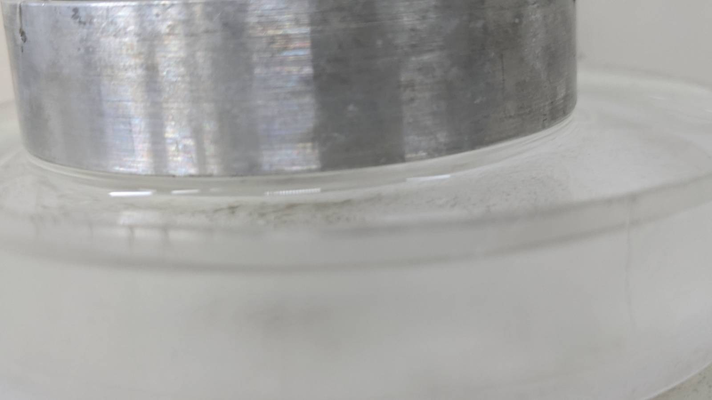
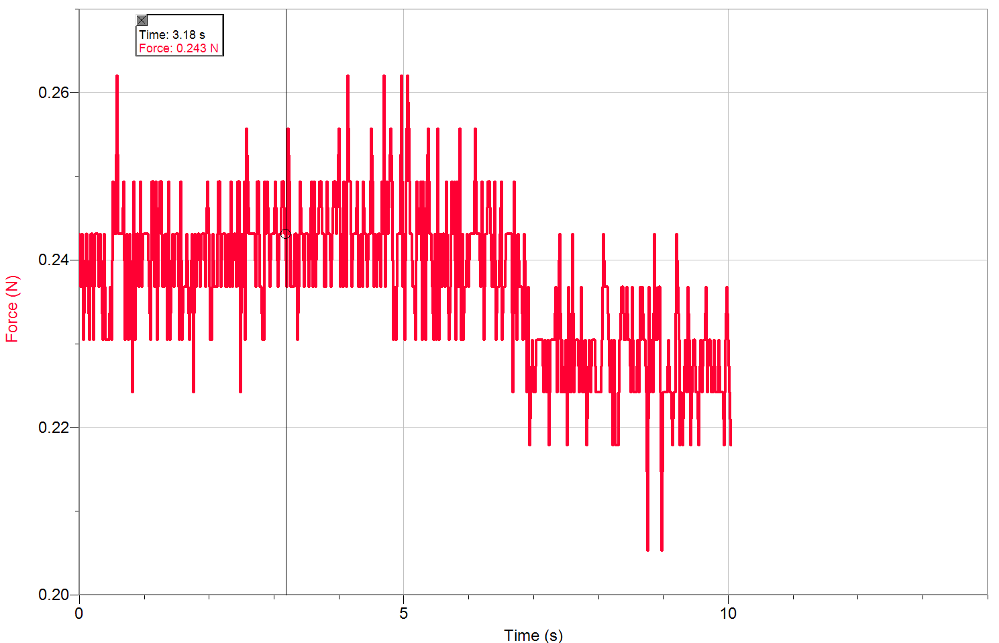
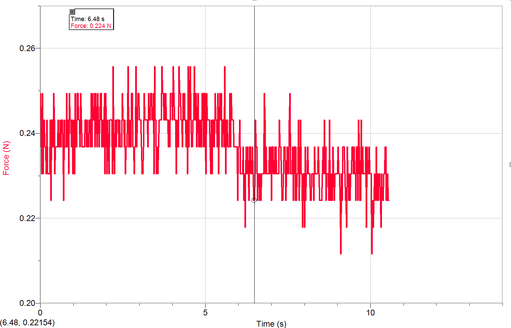
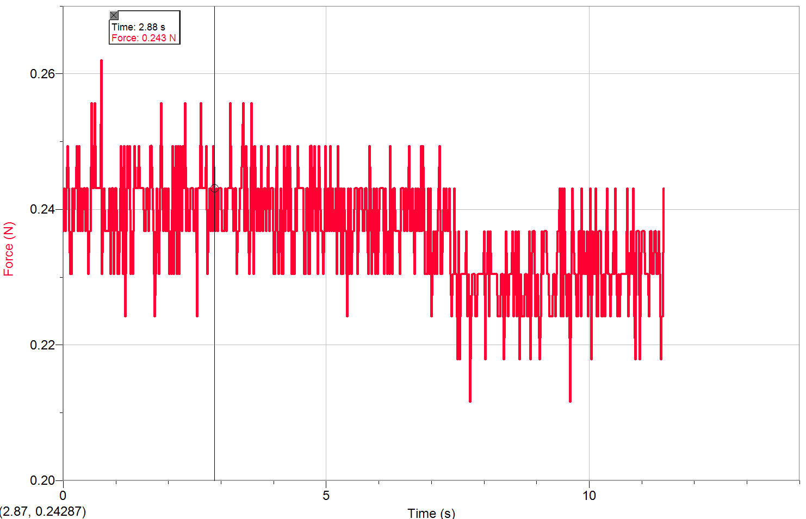
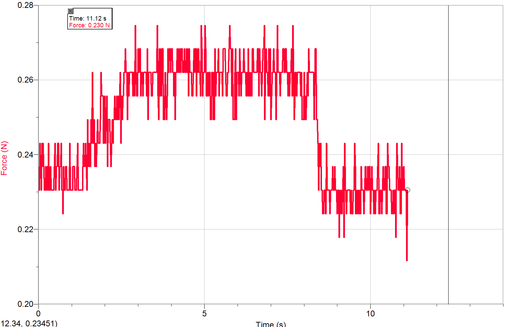
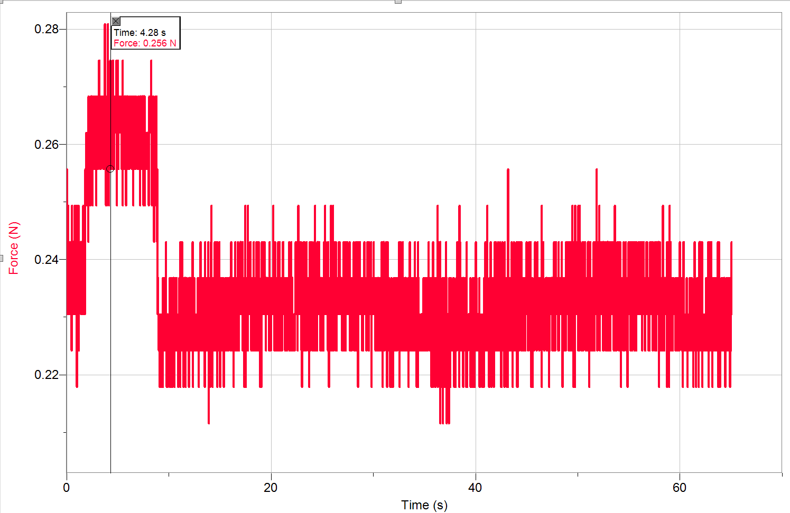
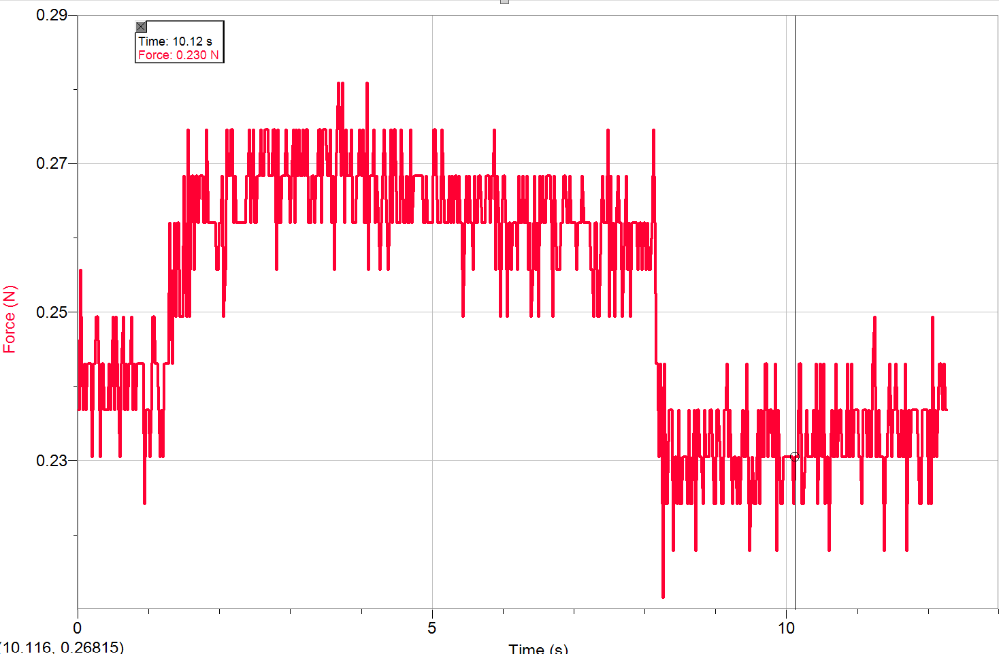
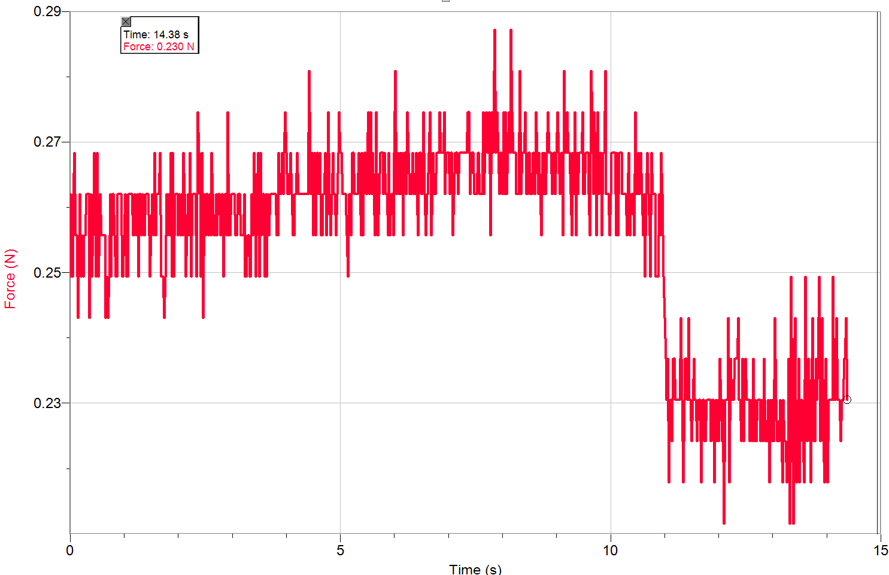

$\pagebreak$

# Aim

Measuring the surface tension of water and ethanol by the ring pull out method.

# Theory

Surface tension is due to the fact that a molecule on the surface of a liquid is acted upon by attractive forces from adjacent molecules towards one side. This resultant force acting on the molecules is perpendicular to the surface and into the liquid. To enlarge the surface, we need to provide energy. The ratio of the energy $\Delta E$ supplied at constant temperature and the change in surface area $\Delta A$ is called surface tension

$$\sigma = \frac{\Delta E }{\Delta A}$$

We will measure the surface tension by immersing a metal ring first and forming an inner and outer layer of liquid. The change in the surface of the layer when the metal ring is lifted by $\Delta x$ is given by 

$$\Delta A = 4\pi R \Delta x$$

Now pulling up the ring requires the force $F = \Delta E/\Delta x$. When force is exceeded, the liquid layer breaks away. Surface tension is given by 

$$\sigma = \frac{F}{4 \pi R}$$

{width=65%}

# Materials Required 

- Metal ring 
- Precision dynamometer 
- Vernier Calipers 
- Crystallisation dish 
- Stand and clamps 
- Distilled water and Ethanol

# Method

1. Measure the radius of the ring
2. Install the Labpro software and connect the Labpro with the PC, and connect the force sensor in the analog channel.
3. After cleaning the crystallisation dish, fill distilled water into the crystallisation dish.
4. Lower the clamp with a hook to immerse the metal ring completely in water 
5. Slowly lower the laboratory stand (on which the crystallisation dish is placed) while observing the tensile force at the sensor. 
6. Read the tensile force just before the layer breaks away 
7. Pour the distilled water out, dry the crystallisation dish and the metal ring and repeat the experiment with ethanol

# Observations

Radius = $(5.663+6.216)/2 = 5.940 cm$

## Ethanol

|Upper      |Lower       |$\Delta F$  | 
|-----------|------------|------------|
|0.2304     | 0.2179     | 0.0125     |
|0.24308    | .2304      | 0.01268    |
|0.243084614|0.230479143 | 0.012605471|
|0.243084614| 0.230479143| 0.012605471|

$\Delta F$ = 0.0126 N

{width=50%}
{width=50%}

{width=50%}
{width=50%}

## Water

|Upper      |Lower      |$\Delta F$ | 
|-----------|-----------|-----------|
|0.261992821|0.230479143|0.031513679|
|0.261992821|0.230479143|0.031513679|
|0.261992821|0.230479143|0.031513679|
|0.261992821|0.230479143|0.031513679|

$\Delta F$ = 0.03151 N

{width=50%}
{width=50%}

{width=50%}
{width=50%}

# Results

For ethanol, surface tension is given by 

$$\sigma = \Delta F/4\pi R  = 0.01688 N/m = 16.9 mN/m$$

For water, surface tension is given by 
$$\sigma = \Delta F/4\pi R  = 0.0422 N/m = 42.2 mN/m$$

Drinking water shows a significantly reduced surface tension from the expected value since it is contaminated with salts. If we use distilled water, we will get higher results. 

# Error analysis

Least count for the radius = 0.001 

The standard deviation in the $\Delta F$ values of water are zero.

Hence error in the case of water $= 0 +0.001/5.940 = 0.0002 = 0.02%$ 

Error in the $\Delta F$ values of ethanol = $\Delta F/F *100+ \Delta R/R*100 = 0.5088 + 0.0168 = 0.5257%$
