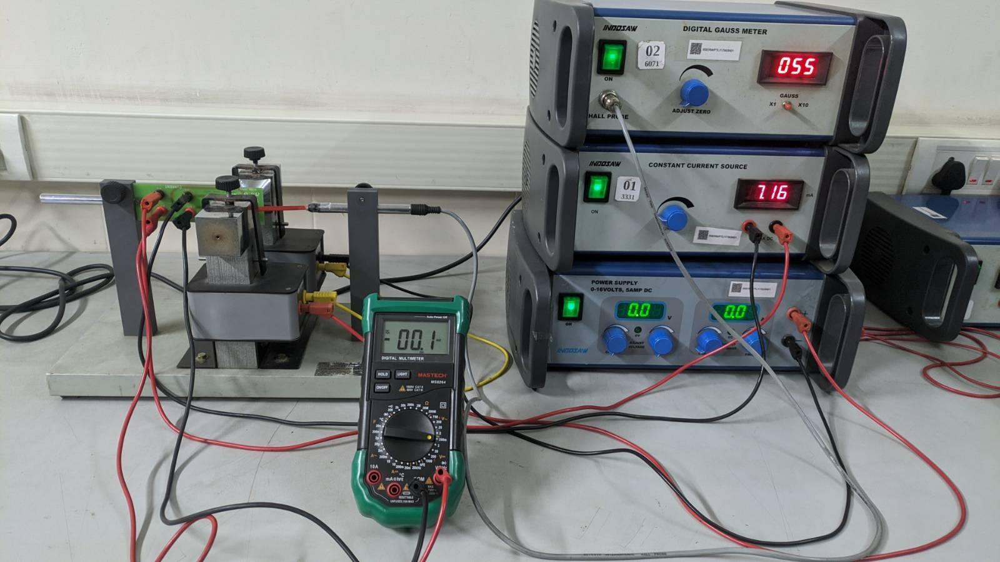
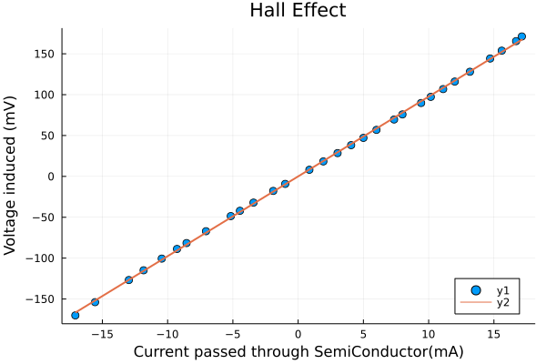

$\pagebreak$

# Aim

1. To measure the Hall effect in a semiconductor, and hence derive certain electrical properties of the semiconductor.

# Method

1. Measure the thickness of the sample as $t$ and resistance as $R$
1. Make connections such that you can pass current and measure the voltage perpendicular to each other in the sample.
2. Connect and place the Electromagnet such that the resulting magnetic field is perpendicular to both current and voltage axes.
3. Place a gauss meter between Electromagnet and sample
4. Calibrate Gauss meter
5. Pass current through the Electromagnet such that the gauss meter reads ~1.5k gauss. Record it as $B$
6. Pass current through the sample from about 1mA to 15 mA.
7. Measure the corresponding voltage.
8. Plot and fit the graph to $y = mx$, with $m$ giving us mean value of $V_H/I$
9. Use $m$ to find the following-
    1. $R_H = mt/B$
    2. $n = 1/R_He$
    3. $r = Rt$
    4. $\mu = R_H/r$
    5. $\theta_H = \tan^-(\mu B)$

# Observation

| Quantity | Value         |
| -------- | ------------- |
| t        | 5e-4m         |
| B        | 0.1464T       |
| R        | 0.870$\Omega$ |

| V (mV) | I (mA) | V (mV) | I (mA) |
| ------ | ------ | ------ | ------ |
| 0.86   | 8.1    | 16.7   | 165.5  |
| 1.93   | 18.3   | 17.14  | 171.2  |
| 3.02   | 28.5   | -1.91  | -17.8  |
| 4.06   | 38.2   | -3.42  | -32.1  |
| 5	     | 47.1   | -4.46  | -42.1  |
| 6	     | 56.9   | -5.16  | -48.6  |
| 7.35   | 69.6   | -7.06  | -67.1  |
| 7.99   | 75.8   | -8.55  | -81.6  |
| 9.42   | 89.8   | -9.28  | -88.8  |
| 10.16  | 97.3   | -10.45 | -100.6 |
| 11.11  | 106.8  | -11.84 | -114.9 |
| 12     | 116    | -12.97 | -126.8 |
| 13.16  | 128    | -15.56 | -153.9 |
| 14.71  | 144.2  | -17.07 | -170.1 |
| 15.6   | 153.8  |        |        |

{width=65%}

# Results

{width=65%}

1. Mean of $V_H/I = 9.76 \pm 0.3% \Omega$
2. Hall Coefficient $R_H=0.0333 \pm 2.368 % \Omega m T^-1$
3. $n = 1.88\cdot 10^20 \pm 2.368%$
4. Resistivity $r= 4.35\cdot 10^-4 \pm 2.11% \Omega m$
5. Mobility $\mu= 76.6 \pm 4.478% m^2V^{-1}s^{-1}$
6. Hall angle $\theta_H = 1.48 rad$

